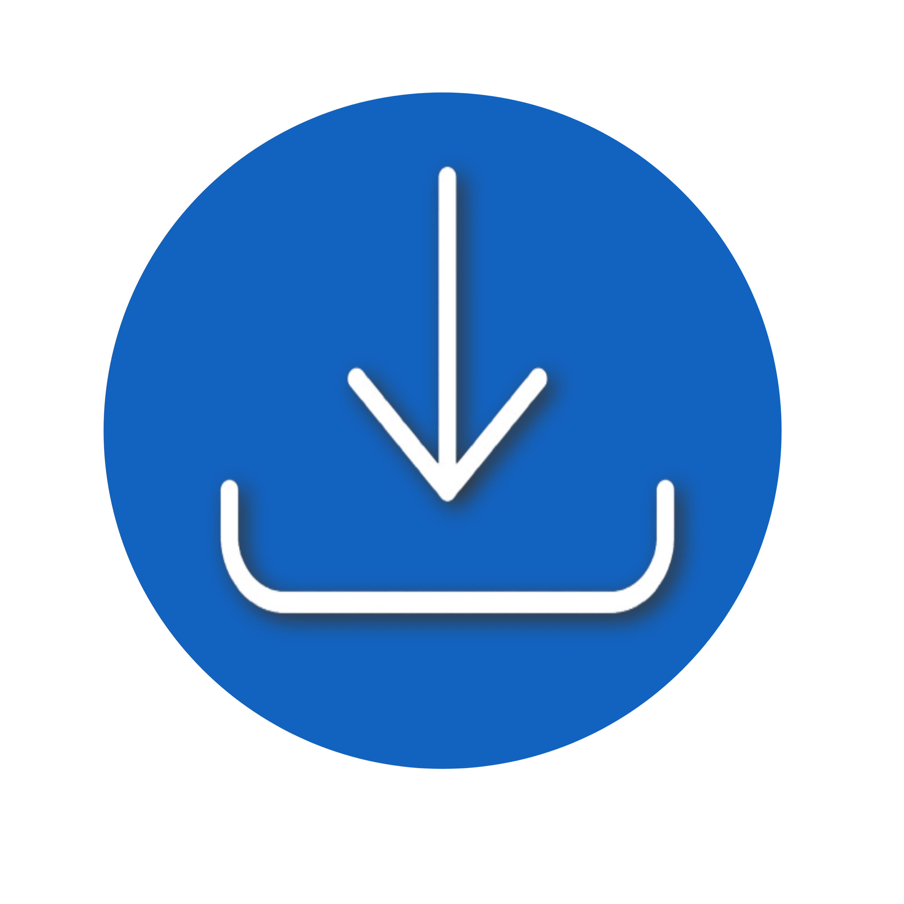

# Setup Master

<!-- -->

  

This VS Code extension makes it easy to install frontend and backend dependencies without using the terminal. Browse through categories, choose the libraries you need, and install them with one click!

<!-- ## Installation

 -->

1. Open **Visual Studio Code**.
2. Navigate to the **Extensions** view (`Ctrl+Shift+X`).
3. Search for `Setup Master` and click **Install**.
4. [Marketplace Link](https://marketplace.visualstudio.com/items?itemName=SetupMaster.SetUp-Master).

## Features

- **Categorized Dependencies**: Browse and install dependencies for frontend, backend, state management, UI libraries, and more.
- **One-click Installations**: No need for terminal commands – select and install directly from the sidebar.

## Categories

### Frontend

- **Languages**: JavaScript, TypeScript
- **Frameworks**: React, Next.js, Vite
- **Styles**: Tailwind CSS, Bootstrap
- **UI Libraries**: Shadcn
- **State Management**: Redux, Jotai, Zustand
- **Icons**: Lucide, React Icons
- **Charts**: Chart.js, Recharts
- **Notifications**: React Toastify, React Hot Toast
- **Animations**: Framer Motion, GSAP
- **Other Libraries**: Axios, Zod, Moment.js, React Hook Form

### Backend

- **Languages**: JavaScript, TypeScript
- **Frameworks**: Express
- **Databases**: MongoDB
- **Other Libraries**: Nodemon, Axios, Json Web Token, Cors

